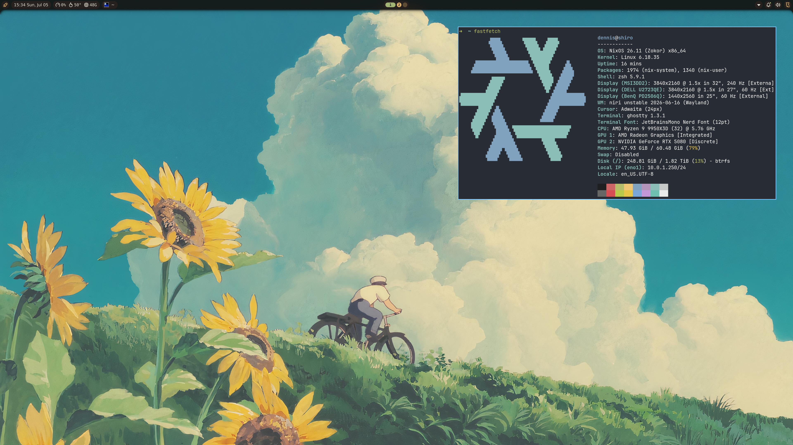

# Nix Config
My current and everchanging dendritic Nix configuration flake.



## Helpful Commands
```sh
# Rebuild shiro and switch to new generation
nix run .#shiro -- switch

# Format all files
treefmt

# Output current Noctalia config in JSON
nix run nixpkgs#noctalia-shell ipc call state all > ./modules/features/noctalia.json
```
